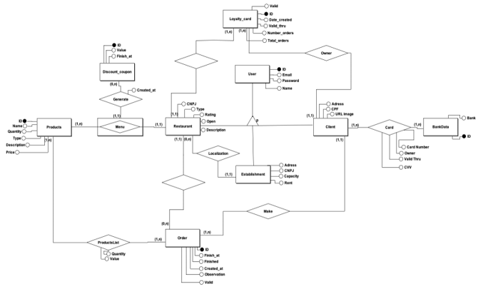

# **Documentação do projeto E-cantina**

## Experiência Criativa: Projetando soluções computacionais

 

## Nome dos integrantes da equipe **- Grupo 1**:
 * Guilherme Illescas
 * Lucas Augusto da Silva
 * Lucas Rossi
 * Mauricio Kenzo De Albuquerque Kikuchi
 * Vitor José Misocami Alvarenga

## Nome dos professores:
 * Cristina Verçosa Peres Barrrios de Souza
 * Marco Antônio Paludo

 

## PRODUCT BACKLOG BUILDING (PBB)

 

**PRODUCT VISION:**

  

  Certamente o product vision consegue retratar muito bem as principais características do produto e servir até mesmo de lembrete daquilo que terá que ser criado ao longo de todo o processo, visando o atendimento das necessidades dos clientes e às boas práticas de programação.

 

**PRODUCT BACKLOG BUILDING:**

  

  Essa metodologia facilita na compreensão daquilo que será desenvolvido, fornecendo uma visão geral; também permite que haja uma redução de possíveis falhas oriundas do mal planejamento, pois o PBB fornece um rico detalhamento; é uma forma de se trabalhar colaborativamente, na qual há uma troca de ideias e de saberes muito bacana entre os integrantes da equipe.

 

## TRELLO

 

**TRELLO:**

  

  O Trello foi utilizado para gerenciar as tarefas de acordo com os critérios de desenvolvimento, responsabilidade e tempo.

 

**INTEGRANTES:**

  

  Os participantes foram devidamente convidados.

 

**SPRINTS:**

  

  As sprints foram separadas de acordo com a coloração de suas etiquetas. Como pode ser visto, a cor alaranjada representa a primeira entrega, já a roxa, o da segunda.

 

  

  Cá está o exemplo dos itens que compuseram a Sprint 1.

 

**CRITÉRIOS:**

  

  As user stories e os critérios de aceite foram devidamente acrescentados. Ademais, consta-se o checklist das atividades conforme o requisitado.

 

## BANCO DE DADOS

 

**DIAGRAMA ENTIDADE-RELACIONAMENTO:**

  

  O Diagrama Entidade-Relacionamento (DER) representa todo o projeto. Tendo isso em vista, o banco de dados foi criado e conectado com o Java através do String Data JPA. Cada entidade tem um identificador único; atributos e cardinalidades foram mostrados.

 

## DIAGRAMAS

 

[**DIAGRAMA DE MÁQUINA DE ESTADO:**](https://lucid.app/lucidchart/b5544d9f-6f5b-4fd9-a37e-ffbc7bd72855/edit?shared=true&invitationId=inv_6ea9bb4c-4df7-4b55-8357-9a0b9a3e84e5&page=0_0#) (clique no link)

  

 

[**DIAGRAMA DE ATIVIDADES:**](https://lucid.app/lucidchart/a263e6ad-b41d-4d84-87ea-1ec397511e3b/edit?invitationId=inv_f4ff4473-397d-4565-ad7b-b91c5ce9f6b6&page=QI8tGpfONKnS#) (clique no link)

  

 

## FERRAMENTAS UTILIZADAS

 * **JPA**: Conecta com banco de dados via ORM (object relation mapping)
 * **Java**: Linguagem de programação orientada a objetos para o back-end
 * **MySQL**: Banco de dados relacional de linguagem SQL para persistência de dados
 * **React Js**: Biblioteca de front-end para a criação de interfaces mantida pelo Facebook
 * **Spring**: Framework Java que permite que facilita a criação de APIs Rest em aplicações

 

## ARTE & DESIGN

 

**LOGO:**

  

 

**CORES:**
 * #EE6C4D
 * #8D99AE
 * #303030
